# ZeppOS-School Calendar

## V3. ChangeLog:

#### !!!. For making program less busy, the program data is inside the Calendar folder, in order of deleting the readme.md images:

#### 1. Added a new user friendly interface to set your subjects:

First select your profile:

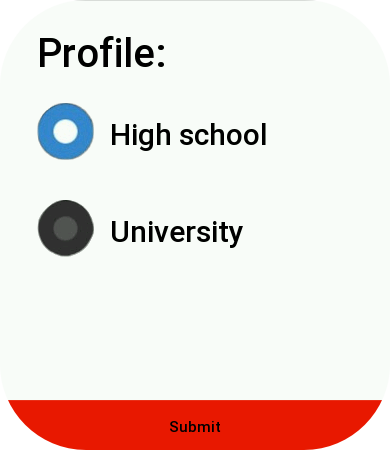

Then select your subjects:

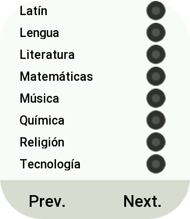

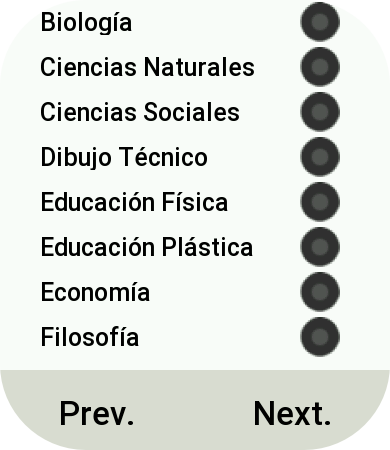

Or jus add your own ones:

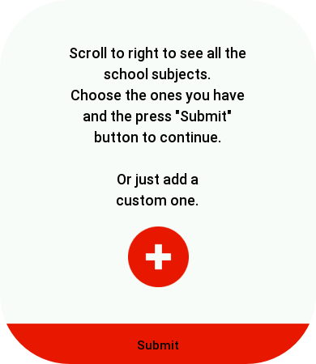

#### 2. Then configure your schedule times.

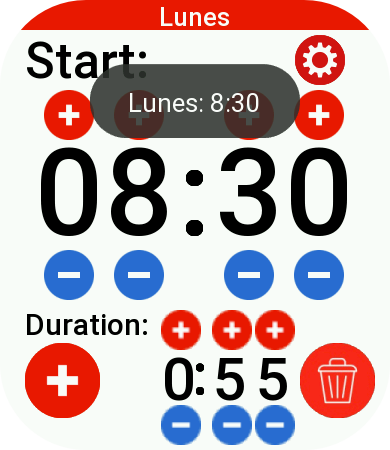

If you want, press the settings button to add that day´s schedule to other days, just to save time.

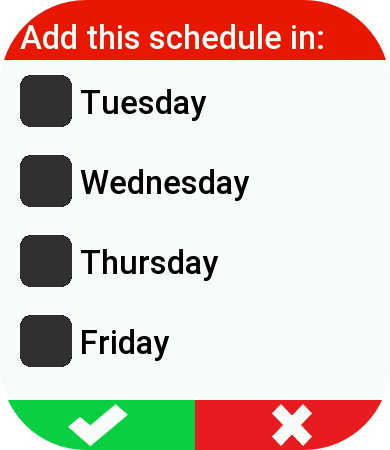

#### 3. Set your subjects in the schedule.

click in a rectangle in order to modify it.

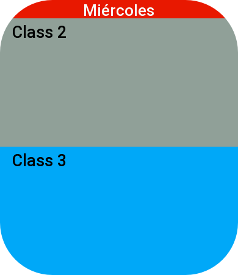

Press "+" button to set the current class´s subjesct.

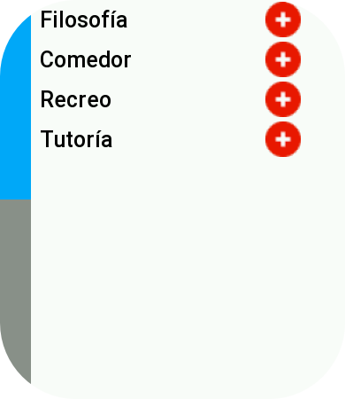

#### 4. Added a configuration page.

Set your favourite theme between 6 themes.

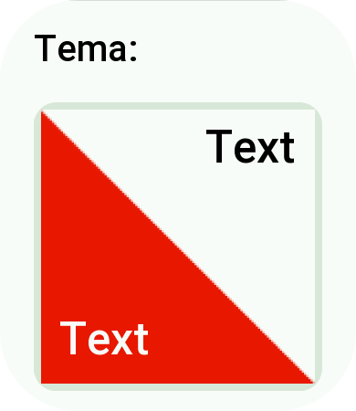

Set another useful configurations.

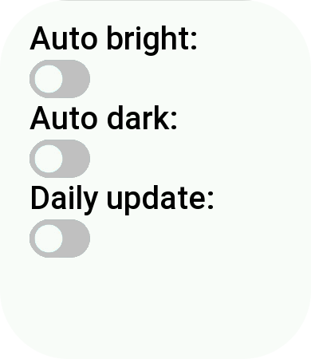

Change your languaje. (Don`t avaliable yet, only interface)

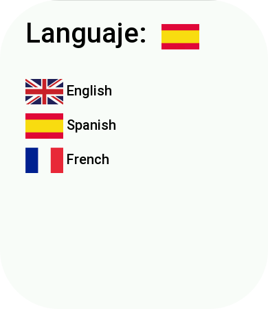

Or restore app data.

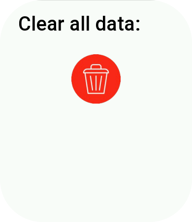

#### 5. Improved User interface.

More beautiful program init page.

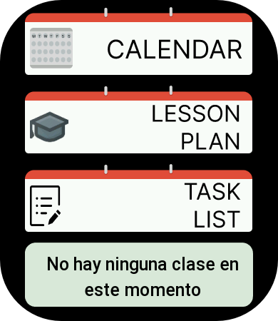

Now the calendar will display the days in which you have any task (Click on the day to display the tasks filtered by that day).

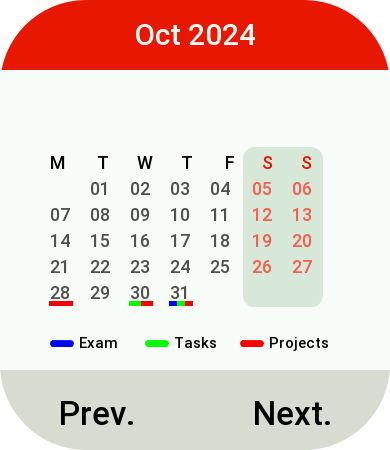

#### 5. Now you can ask program to remember you a task.

For do that, click on a task and it the menu click the bell icon.

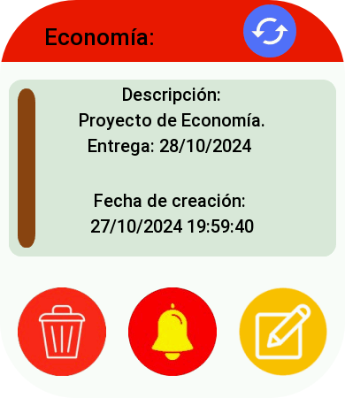

Set the time in whick you want to app remember you the task

(If there more that 1 tasks for a date all tasks will be displayed)

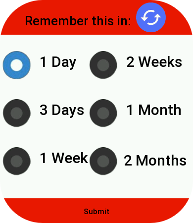

When is the time, you will see this with a cool animation.

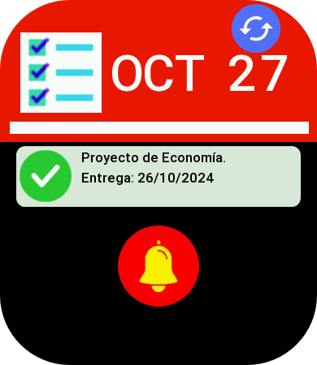

And if you want, ask the app to remember the task again in a short time amount.

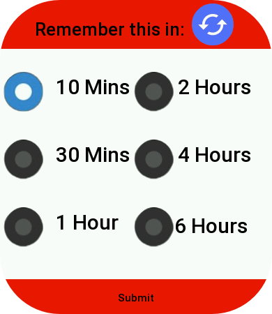

# Enjoy!!!
--------------------------------------------------------------------------------------------------------------------------
# ZeppOS-School Calendar

## V2. ChangeLog:

#### 1. Modify new task screen:

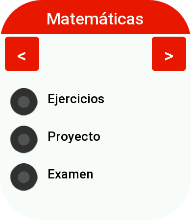

#### 2. Update Exam type task, now you can select which type of exam is: Parcial or final.

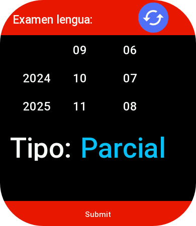

#### 3. Update Ejs new task page screen, now you can add until 10 exs for a page.

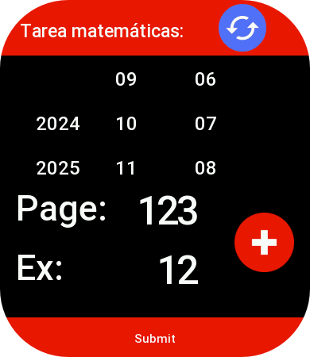

#### 4. Update Rects´s color on task page screen (Edit button on delete page don´t work for now).

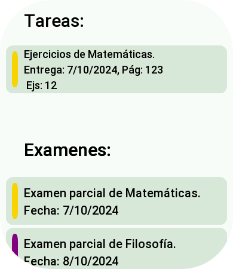

#### 5. Now you can see what task you have on a day in the calendar page (for unknow reasons circles arent showed in my device), click in a day that have a task to see all the task in that day.

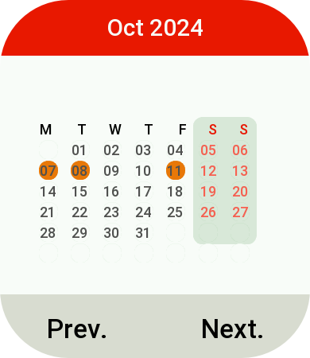

#### 6. Filtered task of a day ´s page.

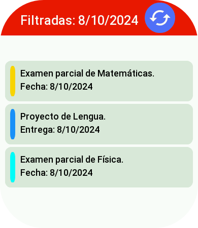

# Enjoy!!!
--------------------------------------------------------------------------------------------------------------------------

# ZeppOS-School Calendar

## V1

## Schedule calendar App for Zepp os users.

For now, app can only be runed on amazfit gts 3, and app´s languaje is Spanish, this will be updated in the future.

This is app interface:

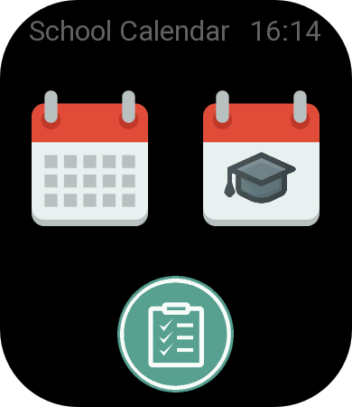

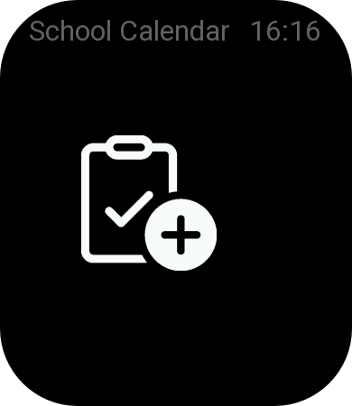

For now in the calendar, you can only see a calendar, in future, a better implementation with task will be added.

In the schhol calendar, you will, be able to see your current day schedule and the other days ones.

How to set your schedule will be explained later...

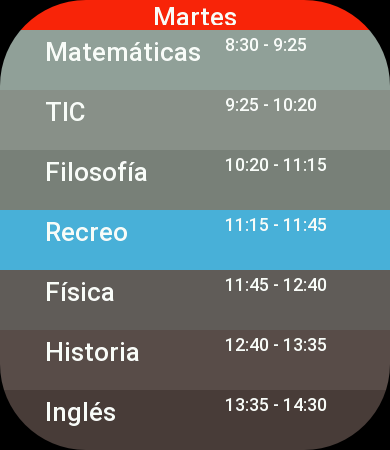

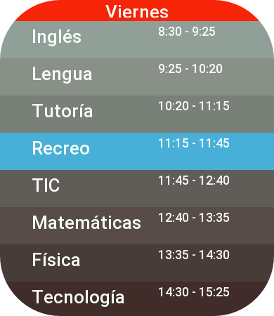

Swipe to the last page to enter to the new task creation manager.

Click it and here is Interface:

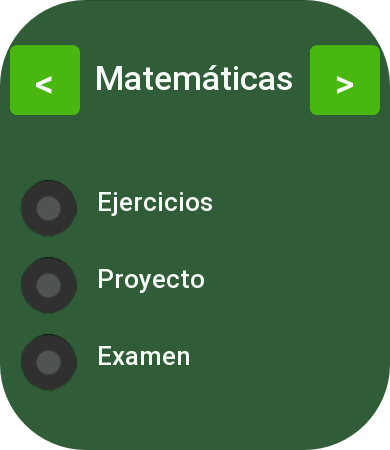

Click on the arrows to change between the subjects (more will be added in the future).

Click on the dots to select the New Task type, after that, you will see this:

This is a new Task, which type is task (avaliable are task, exam and project), so you will have to select the deadline date and which exercises you are asked to make for.

Click in a number to move to the next and change pages´s index and move up and down the date to select one date

When all is good, just press submit button, and you will be redirected into the previous page, in case you want to create another task,

make the previous steps again, else, swipe left to go the last page.

Here is Task manager Page

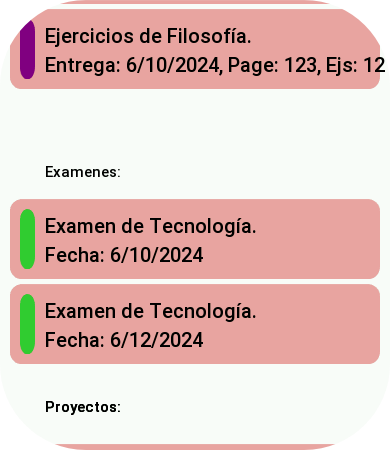

Touch in a task in order to delete it or see a few more data about it...

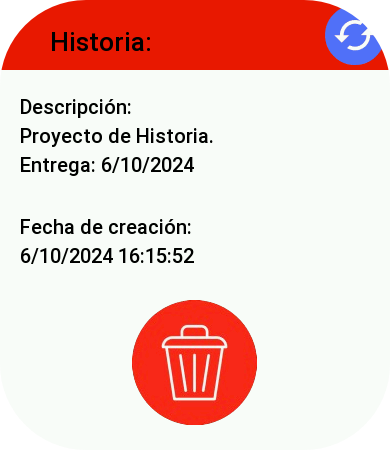

In case you dont have task, you will see this:

# How to use

## Requirements

* [Node.js](https://youtu.be/MrJkkG-yt7A?t=23)
* [ZeusCLI](https://docs.zepp.com/docs/guides/tools/cli/#installing-the-zeus-cli)

## Installation process

#### 1. Download the project.

#### 2. Open it.

#### 3. Go to pages sub-folder.

#### 4. Open in edit-mode index.js

#### 5. After opening you will see this:

            const Calendar = [
      ["Inglés", "Tecnología", "Lengua", "Recreo", "Física", "Historia", "Filosofía"],
      ["Matemáticas", "TIC", "Filosofía", "Recreo", "Física", "Historia", "Inglés"],
      ["TIC", "Historia", "Filosofía", "Recreo", "Tecnología", "Matemáticas", "Lengua", "Física"],
      ["Lengua", "Matemáticas", "Historia", "Recreo", "Tecnología", "TIC", "Inglés"],
      ["Inglés", "Lengua", "Tutoría", "Recreo", "TIC", "Matemáticas", "Física", "Tecnología"]
    ]

#### 6. Just put your subjects in each gap, without adding or deleting any one, if there arent no more subjects today just don´t put nothing(this will be added in future)

#### 7. YOU MUSN´T DELETE THE "" AT THE INIT OF EACH SUBJECT, IF YOU DO, PROGRAM WON´T WORK

#### 8. Modifying your subjects time...

#### 9. In next line, you will see this:

    var initsHour = ["8", "9", "10", "11", "11", "12", "13", "14"]
    var endHour = ["9", "10", "11", "11", "12", "13", "14", "15"]
    var initMinute = ["30", "25", "20", "15", "45", "40", "35", "30"]
    var endMinute = ["25", "20", "15", "45", "40", "35", "30", "25"]

#### 10. Just modify it according to your needs, I think it is not need to be mentioned how to do it...

#### 11. YOU MUSN´T DELETE THE "" AT THE INIT OF EACH SUBJECT, IF YOU DO, PROGRAM WON´T WORK

#### 12. Save the file and use Zeus Cli tool to see it your watch

App will be more user-friendly in future for now, this is what it is...

ANY SUGGESTION WILL BE GREATLY APPRECIATED.

## Zepp-School-Calendar
